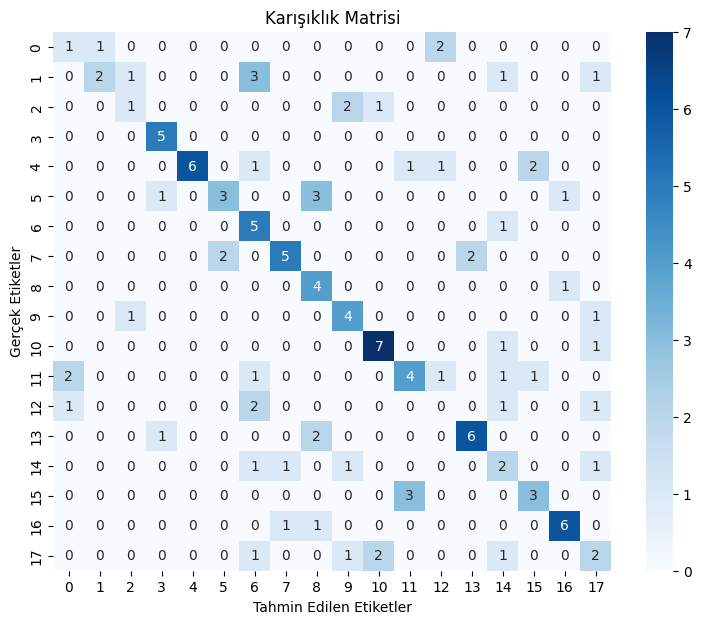
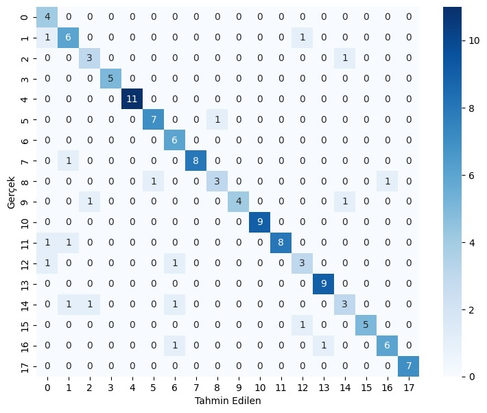

# Columnist Author Identification Project

This project aims to perform author identification on a dataset consisting of columns from Turkish newspapers written by 18 different authors.

## Dataset

The dataset comprises 630 Turkish columns, each written by one of 18 different authors. The data is sourced from "news-paper".

## Algorithms Used

The project employs the following machine learning algorithms for author identification:

- Bert
- LSTM
- XGBoost
- Decision Tree
- Naive Bayes
- Random Forest
- KNN (K-Nearest Neighbors)
- Gradient Boost
- SGD (Stochastic Gradient Descent)
- SVM (Support Vector Machine)

## Application Steps

1. Loading and Preprocessing the Dataset
2. Implementation and Training of Each Algorithm
3. Evaluation of Model Performance
4. Selection of the Best Performing Models

## Best Performing Models

The project has identified Bert and SVM algorithms to achieve the highest accuracy scores. Below are the confusion matrices and accuracy values for these models:

### Bert Model

Confusion Matrix:

Accuracy: 0.9793650793650793

### SVM Model

Confusion Matrix:

Accuracy: 0.8492063492063492

## Stopwords

The Turkish stopwords used in this project were obtained from [countwordsfree](https://countwordsfree.com/stopwords/turkish).

## Contributors

Special thanks to my friend [Levent Demirkaya](https://github.com/leventDemirkaya) for their valuable contributions to this project.
